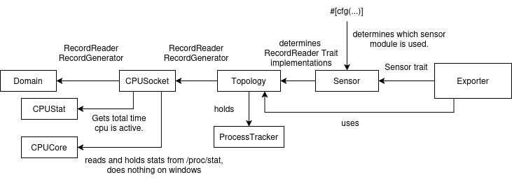

# How To Start Implementing A New Sensor

This guide provides an overview of the internal architecture of sensors and the steps to implement a new sensor without touching exporter code.

## Important Structs and Traits

First an overview of the the structs and traits defined in sensors/mod.rs. 

```rust,noplayground
pub struct Record {
    pub timestamp: Duration,
    pub value: String,
    pub unit: units::Unit,
}
```
`Record` is used to represent an electricity consumption measurement. Exporters expect the records passed to them to be monotonically increasing.

```rust,noplayground
/// Sensor trait, the Sensor API.
pub trait Sensor {
    fn get_topology(&self) -> Box<Option<Topology>>;
    fn generate_topology(&self) -> Result<Topology, Box<dyn Error>>;
}
```
The `Sensor` trait is used by exporters to get an instance of a topology struct.

```rust,noplayground
/// Defines methods for Record instances creation
/// and storage.
pub trait RecordGenerator {
    fn refresh_record(&mut self);
    fn get_records_passive(&self) -> Vec<Record>;
    fn clean_old_records(&mut self);
}
```
`RecordGenerator` is queried by exporters to obtain new records. RecordGenerator implementations are not specific to a sensor type, its purpose is to manage the record buffers of the `Topology`, `CPUSocket` and `Domain` structs (structs implement `RecordGenerator` within sensors/mod.rs). It uses the `RecordReader` trait to generate new records itself.

```rust,noplayground
pub trait RecordReader {
    fn read_record(&self) -> Result<Record, Box<dyn Error>>;
}
```
`RecordReader` is responsible for obtaining measurements from the underlying sensor. The `RecordReader` trait is implemented within the specific sensor's .rs file and accounts for the differing behavior between sensors.
```rust,noplayground
/// Topology struct represents the whole CPUSocket architecture,
/// from the electricity consumption point of view,
/// including the potentially multiple CPUSocket sockets.
/// Owns a vector of CPUSocket structs representing each socket.
#[derive(Debug, Clone)]
pub struct Topology {
    /// The CPU sockets found on the host, represented as CPUSocket instances attached to this topology
    pub sockets: Vec<CPUSocket>,
    /// ProcessTrack instance that keeps track of processes running on the host and CPU stats associated
    pub proc_tracker: ProcessTracker,
    /// CPU usage stats buffer
    pub stat_buffer: Vec<CPUStat>,
    /// Measurements of energy usage, stored as Record instances
    pub record_buffer: Vec<Record>,
    /// Maximum size in memory for the recor_buffer
    pub buffer_max_kbytes: u16,
    /// Sorted list of all domains names
    pub domains_names: Option<Vec<String>>,
    /// Sensor-specific data needed in the topology
    pub _sensor_data: HashMap<String, String>,
}
```
The `Topology` struct implements `RecordReader` and `RecordGenerator`.
Exporters use it to query for records and can access its fields for more specific information. 
The `ProcessTracker` field is particularly of note since it attributes energy consumption to individual processes. 
The `Topology` struct is the main point of contact between sensors and exporters.

```rust,noplayground
/// CPUSocket struct represents a CPU socket (matches physical_id attribute in /proc/cpuinfo),
/// owning CPU cores (processor in /proc/cpuinfo).
#[derive(Debug, Clone)]
pub struct CPUSocket {
    /// Numerical ID of the CPU socket (physical_id in /proc/cpuinfo)
    pub id: u16,
    /// RAPL domains attached to the socket
    pub domains: Vec<Domain>,
    /// Text attributes linked to that socket, found in /proc/cpuinfo
    pub attributes: Vec<Vec<HashMap<String, String>>>,
    /// Path to the file that provides the counter for energy consumed by the socket, in microjoules.
    pub counter_uj_path: String,
    /// Comsumption records measured and stored by scaphandre for this socket.
    pub record_buffer: Vec<Record>,
    /// Maximum size of the record_buffer in kilobytes.
    pub buffer_max_kbytes: u16,
    /// CPU cores (core_id in /proc/cpuinfo) attached to the socket.
    pub cpu_cores: Vec<CPUCore>,
    /// Usage statistics records stored for this socket.
    pub stat_buffer: Vec<CPUStat>,
    /// Sensor-specific data that has been stored at the topology generation step.
    #[allow(dead_code)]
    pub sensor_data: HashMap<String, String>,
}
```
This struct represents a CPUSocket. It implements both `RecordGenerator` and `RecordReader`. It can be accessed by exporters via the `Topology` struct to get CPUSocket specific records.

```rust,noplayground
/// Domain struct represents a part of a CPUSocket from the
/// electricity consumption point of view.
#[derive(Debug, Clone)]
pub struct Domain {
    /// Numerical ID of the RAPL domain as indicated in /sys/class/powercap/intel-rapl* folders names
    pub id: u16,
    /// Name of the domain as found in /sys/class/powercap/intel-rapl:X:X/name
    pub name: String,
    /// Path to the domain's energy counter file, microjoules extracted
    pub counter_uj_path: String,
    /// History of energy consumption measurements, stored as Record instances
    pub record_buffer: Vec<Record>,
    /// Maximum size of record_buffer, in kilobytes
    pub buffer_max_kbytes: u16,
    /// Sensor-specific data that has been stored at the topology generation step.
    #[allow(dead_code)]
    sensor_data: HashMap<String, String>,
}
```
The `Domain` struct represents a part of the CPUSocket from the electricity consumption point of view, such as the core, uncore and DRAM. It implements `RecordReader` and `RecordGenerator`.

## How everything fits together



The above diagram shows how exporters access records and information from the sensor structs.
1. First the exporter uses the Sensor trait to get a topology struct.
2. The sensor used (powercap_rapl, msr_rapl or another) is determined by a conditional compilation (`#[cfg(..)]`). Only one sensor module can be included in the binary, otherwise there would be multiple RecordReader implementations.
3. The exporter calls the RecordGenerator trait on the Topology struct instance to retrieve records.
4. For the RAPL-based sensors, the Topology struct queries records from its list of CPUSockets, which in turn query `Vec<Domain>` for records.

## Implementing A New Sensor

In essence, implementing a new sensor requires:

- Adding a feature flag for the new sensor.
- Creating a new module under src/sensors/ that:

  - Defines a struct implementing the Sensor trait.
  - Provides RecordReader implementations for Topology, CPUSocket, and Domain.
  - Declare it as a module in sensors/mod.rs, gated behind conditional compilation.
  

- Modifying the `build_sensor` function in main.rs and `get_default_sensor` function in lib.rs to return the new sensor.
- Modifying the `#[cfg()]` conditions to guard against conflicting trait implementations and fixing any resulting definition errors.