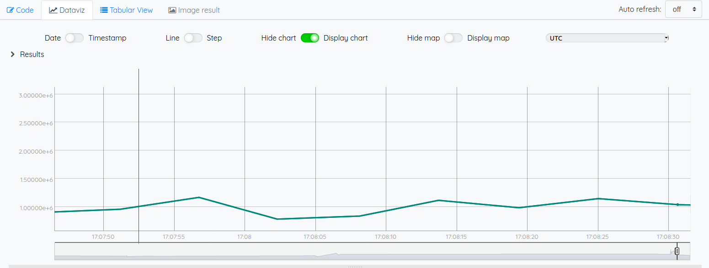

# Warp10 exporter



## Usage

You can launch the Warp10 exporter this way (running the default powercap_rapl sensor):

	scaphandre warp10

You need a token to be able to push data to a [warp10](https://warp10.io) instance.
The `SCAPH_WARP10_WRITE_TOKEN` env var can be used to make it available to scaphandre.
Please refer to the warp10 documentation to know how to get the token in the first place.

As always exporter's options can be displayed with `-h`:

```
Expose the metrics to a Warp10 host, through HTTP

Usage: scaphandre warpten [OPTIONS]

Options:
  -H, --host <HOST>                FQDN or IP address of the Warp10 instance [default: localhost]
  -p, --port <PORT>                TCP port of the Warp10 instance [default: 8080]
  -S, --scheme <SCHEME>            "http" or "https" [default: http]
  -t, --write-token <WRITE_TOKEN>  Auth token to write data to Warp10. If not specified, you must set the env variable SCAPH_WARP10_WRITE_TOKEN
  -s, --step <SECONDS>             Interval between two measurements, in seconds [default: 2]
  -q, --qemu                       Apply labels to metrics of processes looking like a Qemu/KVM virtual machine
  -h, --help                       Print help
```

With default options values, the metrics are sent to http://localhost:8080 every 60 seconds

Use -q or --qemu option if you are running scaphandre on a hypervisor. In that case a label with the vm name will be added to all `qemu-system*` processes.
This will allow to easily create charts consumption for each vm and defined which one is the top contributor.

Metrics provided Scaphandre are documented [here](references/metrics.md). 